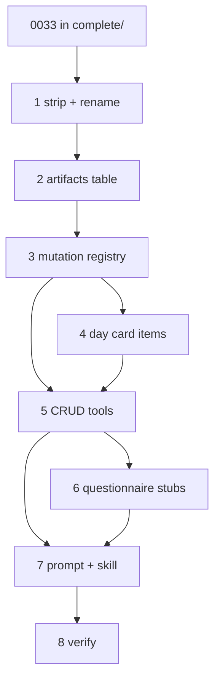

# Fitness strip + Artifact CRUD sub-plans

Parent: [0034-fitness-strip-artifact-crud](./index.md)

**Ship order:** 1 → 2 → 3 → 4 → 5 → 6 → 7 → 8.

Strip + rename first so the tree compiles without fitness callers and without `build-program` / `program-builder` names. Persistence + registry before Day-card item UI and tools. Prompt/skill after tools exist. Verify last (includes former 0033 verify).

**Gate:** ADR 0033 is in `docs/adr/complete/` (C1) — satisfied.

**No per-slice file cap.** Sweeping deletes; split commits only for review/bisect seams.

| # | Doc | Objective | Contracts | Status |
|---|-----|-----------|-----------|--------|
| 1 | [01-strip-fitness-and-rename.md](./01-strip-fitness-and-rename.md) | Delete remaining fitness brain + broken callers; hollow grid; `/dashboard` + `artifact-builder`; drop Hevy edge/seed files | C6–C9, C15, C16 | Done |
| 2 | [02-artifacts-table.md](./02-artifacts-table.md) | `artifacts` migration + read/write API | C5, C6, C13 | Done |
| 3 | [03-artifact-mutation-registry.md](./03-artifact-mutation-registry.md) | Week/day/item mutation ops (fail-all) | C3, C4 | Done |
| 4 | [04-day-card-artifact-items.md](./04-day-card-artifact-items.md) | Hollow Day cards render Artifact items | C4 | Done |
| 5 | [05-artifact-crud-tools.md](./05-artifact-crud-tools.md) | Register `readArtifact` / `mutateArtifact` | C2, C3 | Done |
| 6 | [06-questionnaire-neutral-stubs.md](./06-questionnaire-neutral-stubs.md) | Domain-neutral gate catalog | C10 | Done |
| 7 | [07-prompt-and-skill.md](./07-prompt-and-skill.md) | Neutral instructions + `mutate-artifact` skill | C11 | Done |
| 8 | [08-verify.md](./08-verify.md) | README; contract greps; lint/test/build green (absorbs 0033 verify) | C1–C16 | Done |

## Dependency

## Out of scope (all slices)

- Swapping the grid into outline / card-board / non-day-card artifact
- Dropping or renaming unused fitness / `hevy_*` DB tables (needs explicit operator permission later)
- Empty stub files to fix imports
- Client-seeding an empty `artifacts` row on New arrival
- Restoring `buildProgram`, `getExerciseList`, Hevy export/share, Agentic memory tools
- Hand-editing generated `src/hooks/supabase.ts` (regen after migration only)
- Creating the remote `hackathon_template` GitHub repo
