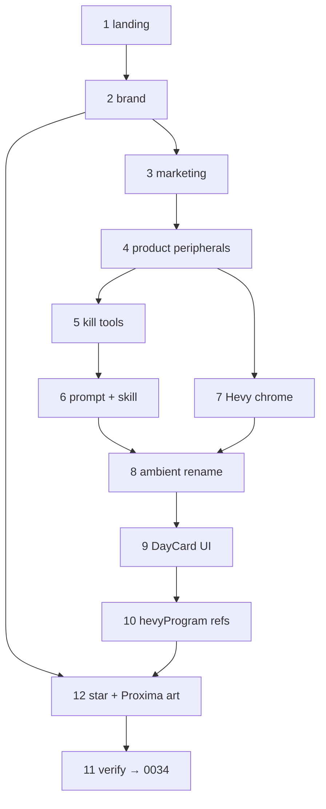

# Shipworthy hackathon template sub-plans

Parent: [0033-shipworthy-hackathon-template](./index.md)

**Ship order (historical):** 1 → 2 → 3 → 4 → 5 → 6 → 7 → 8 → 9 → 10 → 12 → 11.  
Slices 1–10 and 12 are done. Slice 11 is **absorbed by [ADR 0034](../../0034-fitness-strip-artifact-crud/index.md)** — do not implement verify here.

**No per-slice file cap.** These were sweeping cuts; delete or rename everything a slice owns in one pass.

| # | Doc | Objective | Contracts | Status |
|---|-----|-----------|-----------|--------|
| 1 | [01-landing-hero-only.md](./01-landing-hero-only.md) | Home = Prompt only; drop bands + footer on `/` | C1 | Done |
| 2 | [02-brand-shipworthy.md](./02-brand-shipworthy.md) | Hero/placeholder/agent display strings | C2 | Done |
| 3 | [03-strip-marketing-and-footer.md](./03-strip-marketing-and-footer.md) | Delete marketing routes; gut footer/nav links | C6 (partial) | Done |
| 4 | [04-strip-product-peripherals.md](./04-strip-product-peripherals.md) | Pricing, vault, profile, Payload, Public API | C6, C7 | Done |
| 5 | [05-kill-domain-tools.md](./05-kill-domain-tools.md) | Remove killed tools + client land paths | C3 | Done |
| 6 | [06-neutral-prompt-and-skill.md](./06-neutral-prompt-and-skill.md) | Domain-neutral instructions + `mutate-artifact` skill | C4, C5 | Done |
| 7 | [07-strip-hevy-builder-chrome.md](./07-strip-hevy-builder-chrome.md) | Export gate / share / sync UI out of builder | C6 | Done |
| 8 | [08-rename-ambient-grid-types.md](./08-rename-ambient-grid-types.md) | Ambient `THevy*` grid aliases → Artifact/Day | C8, C9 | Done |
| 9 | [09-rename-day-card-ui.md](./09-rename-day-card-ui.md) | `HevyDayCard` and sibling UI file renames | C8 | Done |
| 10 | [10-rename-artifact-program-refs.md](./10-rename-artifact-program-refs.md) | `hevyProgram` / remaining kept-path symbols | C8 | Done |
| 12 | [12-strip-hero-star-and-proxima-brand.md](./12-strip-hero-star-and-proxima-brand.md) | Drop WebGPU hero star; strip Proxima logos/images; document FX stack | C2, C11 | Done |
| 11 | [11-readme-and-verify.md](./11-readme-and-verify.md) | README for clone setup; contract greps; test green | C10, C11 | Absorbed by 0034 |

## Dependency

## Out of scope (all slices)

- New `seedArtifact` / restore `buildProgram` or `getExerciseList`
- Swapping the grid into a non-day-card artifact
- DB migrations renaming or **dropping** `hevy_*` / fitness tables
- Raising or redesigning metering tiers (keep Free paths; delete Stripe upgrade UI only)
- Hand-editing generated `src/hooks/supabase.ts`
- Creating the `hackathon_template` GitHub repo (operator clones manually)
- Finishing a green build after mid-flight fitness deletes — that is ADR 0034
